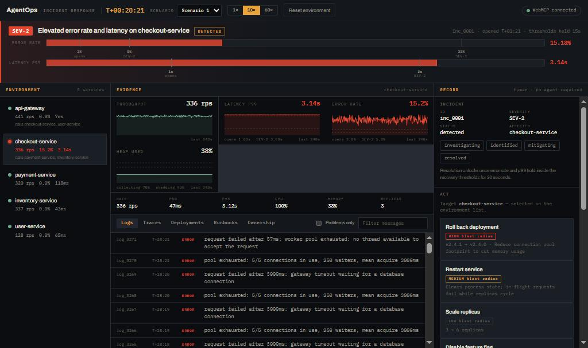
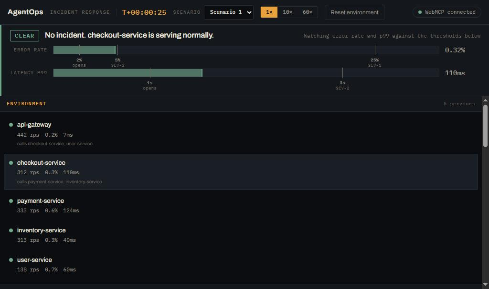
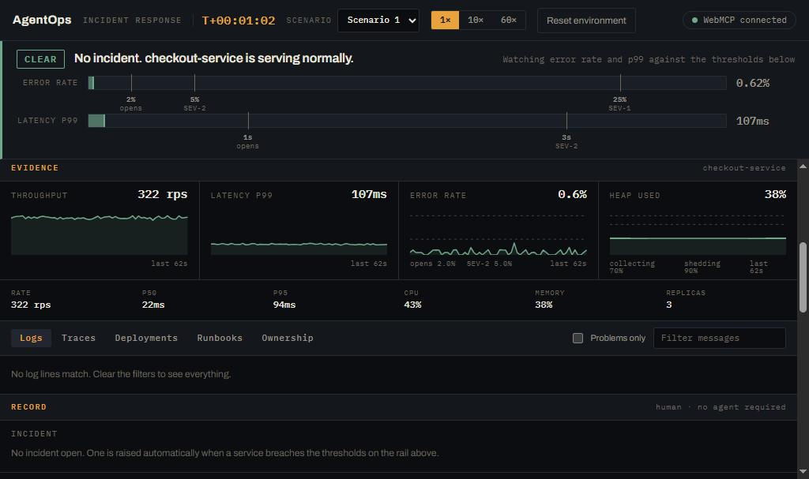
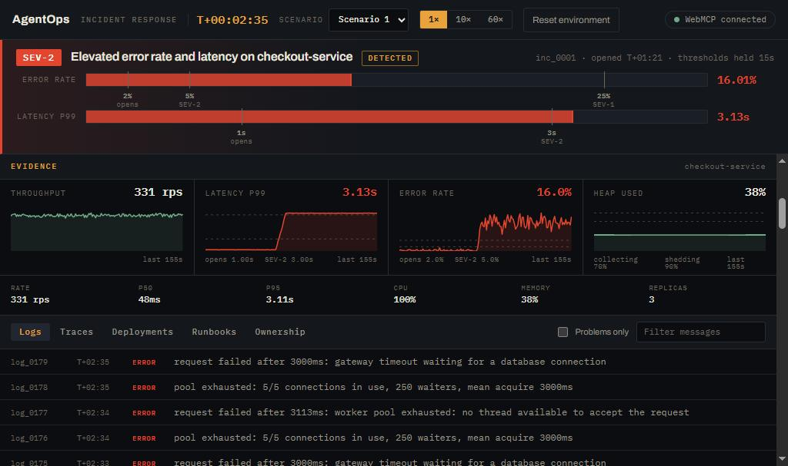
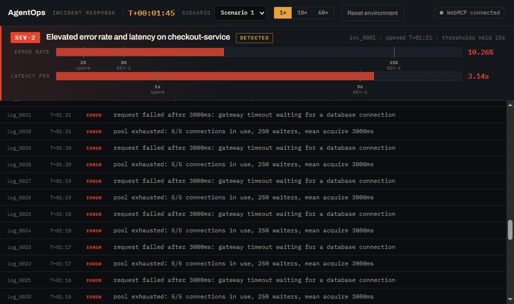
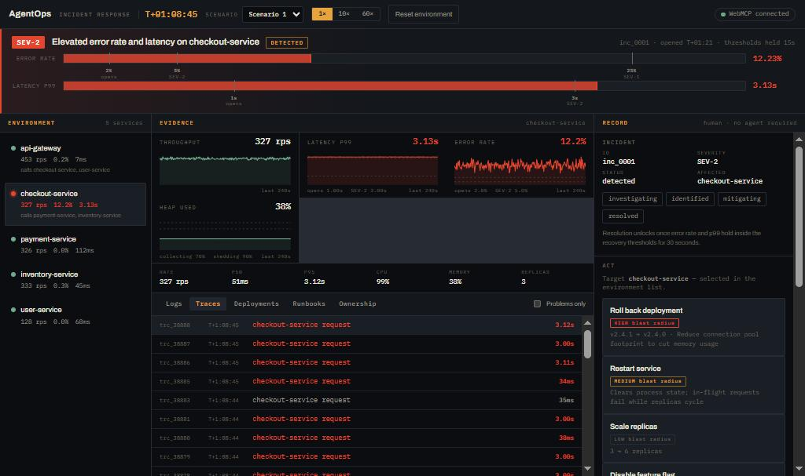
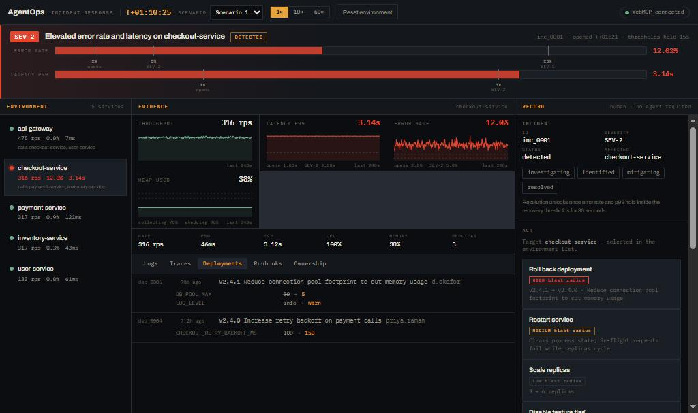
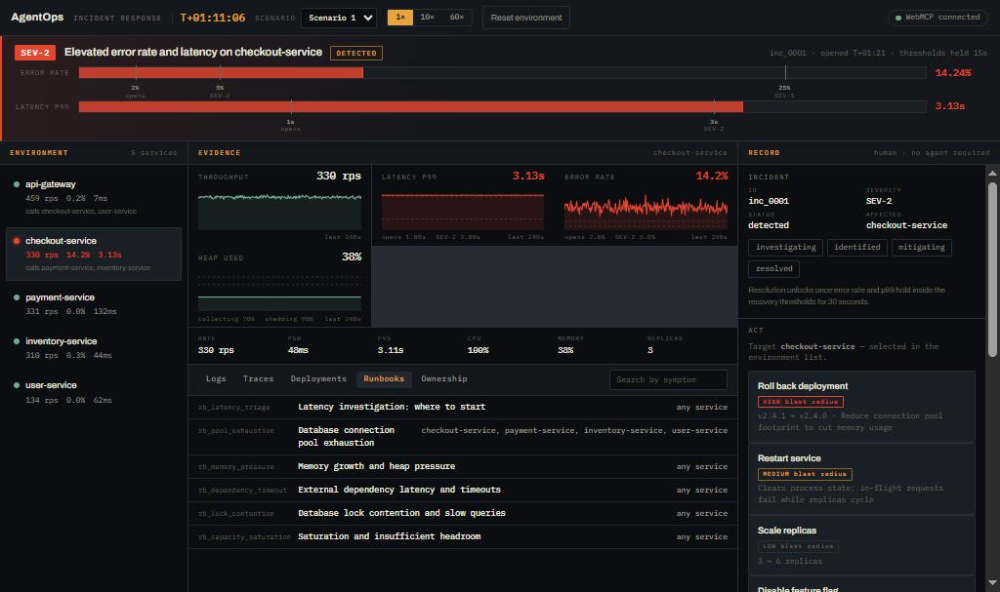
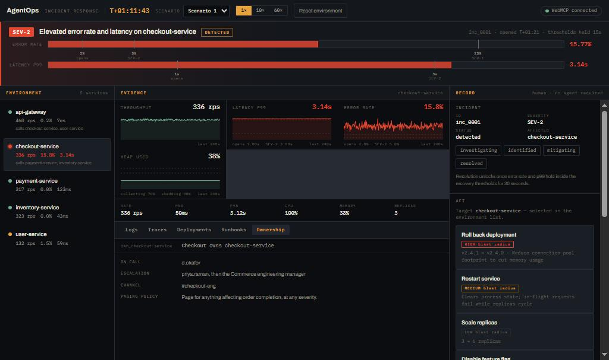
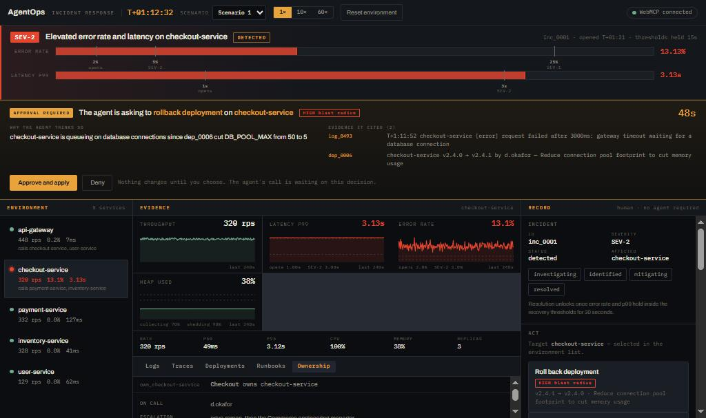

# AgentOps Command Center

[](https://github.com/Hamza-Atiq/webmcp_hackathon_devpost/actions/workflows/ci.yml)

An incident response console where a human and an AI agent work the same live incident together,
built for the **WebMCP Challenge**.

The product exists to demonstrate one claim: *the valuable thing is not agent autonomy, it is a
clear, enforced boundary between what an agent may **observe**, what it may **recommend**, and what
it may **execute**.*

**Live URL:** <https://webmcp-hackathon-devpost.vercel.app>
**Demo video:** _(added at submission)_



---

## What it is

A single-page console containing a **live simulation of a small microservice system** — a seeded
clock, real traffic, and genuine cause and effect. When a bad configuration ships, the numbers
degrade *because the engine computes them that way*, not because a fixture said so. When the change
is rolled back, they recover for the same reason.

On top of that sits a WebMCP tool layer. An agent can investigate the incident across every evidence
source, must support its diagnosis with citations the app verifies, and can only change the
environment after a human clicks Approve.

A human who never opens an agent gets a fully working SRE console. That is deliberate.

## The incident, as a human sees it

The environment starts healthy. The bar across the top is the **alarm rail**: it shows live error
rate and p99 latency against the thresholds that would open an incident, so severity is visibly
*earned* rather than asserted.



Underneath sits the evidence an agent will later read through tools — the four golden signals for
the selected service, and five tabbed sources below them.



Then a deployment lands. Error rate crosses 2%, then 5%; p99 crosses 1s, then 3s. The incident opens
by itself once the breach has held long enough, and the sparklines keep the moment each signal
turned.



Nothing in the scenario file describes those symptoms. It changes one configuration value —
`DB_POOL_MAX` from 50 to 5 — and records the deployment that changed it. The latency climb, the
504s, the growing waiter count and the shape of the traces are all consequences the simulation
computes. That is what makes the investigation real: the answer is not written down anywhere to be
found.

### Five evidence sources

The investigation is genuinely multi-source. No single tab answers it, and each is available to the
human and the agent alike.

| Logs — what the service said about itself | Traces — where the time went inside one request |
|---|---|
|  |  |
| **Deployments** — what changed and when, with the exact settings each release altered | **Runbooks** — the procedures this organisation keeps, indexed by symptom |
|  |  |
| **Ownership** — who to page, how to escalate, which channel the team reads | |
|  | |

Traces are how a service that is *slow* gets told apart from one that is *waiting on something
else*. A runbook names a **failure mode**, never this incident's culprit — matching one confirms a
hypothesis, it never hands over the answer.

## The safety model

Every tool belongs to exactly one side-effect class:

| Class | What it changes | Approval |
|---|---|---|
| **A — Observation** | Nothing | None |
| **B — Record operation** | Incident, proposal and postmortem records only | None, but audited |
| **C — Environment mutation** | The simulated production environment | **Required, always** |

**Exactly one tool is Class C** — `execute_remediation`. It is the entire surface through which
production can change, and it cannot run without a human click. The test suite asserts that as a
*shape* rather than a count: if a second Class C tool ever appears, the build fails.

When an agent calls it, the tool call **suspends** and the operator sees this:



That banner is the whole thesis in one control. It states the action and its blast radius, **why the
agent thinks so** in the agent's own words, and **the evidence it cited** — each id a real record a
read-only tool actually returned, which the operator can go and check. Nothing changes until a
person decides. Exactly one of four events settles the call: approve, deny, a 60-second expiry, or
the environment being reset.

Two further properties are enforced in code rather than in prose:

- **Evidence provenance.** A proposal must cite at least two evidence ids drawn from at least two
  different sources, and every id is checked against what read-only tools actually returned in this
  run. An agent that proposes a remediation as its first call is refused, with instructions.
- **Measured verification.** Whether an incident recovered is computed from metrics, never inferred
  from which action was taken. Approving a wrong fix produces a failed verification.

## The tools

Sixteen tools, registered on the top-level page with `document.modelContext.registerTool`. Twelve
declare `readOnlyHint: true`.

| Tool | Class | What an agent uses it for |
|---|:--:|---|
| `list_services` | A | What exists, how it is wired, what is outside its thresholds |
| `get_service_health` | A | The four golden signals for one service, right now |
| `get_metrics` | A | A time series, to see *when* a signal turned |
| `search_logs` | A | What a service said about itself, by level, substring and window |
| `get_trace` | A | Where the time went inside one request, span by span |
| `list_traces` | A | Representative slow or failed requests when there is no id to follow |
| `list_recent_deployments` | A | What changed, and when, relative to the incident |
| `get_deployment_diff` | A | Which settings one deployment altered, old value and new |
| `get_runbook` | A | The written procedure for a symptom, in the owning team's words |
| `get_service_ownership` | A | Who owns it, who is on call, how they want to be reached |
| `get_incident` | A | The open incident record, its severity and its timeline |
| `verify_remediation` | A | Whether an applied action measurably worked |
| `propose_remediation` | B | Put a diagnosis and an action to the operator, with citations |
| `update_incident_status` | B | Move the incident through its lifecycle |
| `generate_postmortem` | B | Assemble a postmortem from what was actually recorded |
| **`execute_remediation`** | **C** | **Ask a human to approve a proposal, and apply it if they do** |

Every tool returns the same envelope, success and failure alike, and a refusal names what was wrong
*and* what to do instead — the reader is a model that cannot see the screen, so "invalid input" is a
defect rather than a terse style.

## Five scenarios, and why there are five

The scenario picker in the header changes the failure. They are built so that no single heuristic
solves all of them:

| | Failure | Service | Severity | The trap |
|---|---|---|:--:|---|
| **1** | Config regression — connection pool cut 50 → 5 | checkout | SEV-2 | The honest case: a deployment correlates and *is* the cause |
| **2** | Resource exhaustion — a cache that never evicts | inventory | SEV-2 | Memory moves first, latency second, errors last. Watching error rate alone arrives late |
| **3** | Dependency failure — an external provider slows 20× | payment | SEV-2 | **No deployment in the window.** Nothing shipped, nothing was configured |
| **4** | Bad migration holding table locks | user | SEV-2 | A recent deployment correlates in time and is **innocent**. Scaling replicas makes it measurably *worse* |
| **5** | Capacity — a flash sale triples traffic | checkout | **SEV-1** | **No deployment in the window.** Ordinary saturation, not a defect |

Rollback fixes two of the five, a feature flag fixes two, scaling fixes one. An agent with a
favourite action is wrong at least three times out of five — and because verification is measured
rather than assumed, being wrong surfaces as a failed verdict instead of a success message.

## Running it locally

Requires Node 20+.

```bash
npm install
npm run dev      # http://localhost:5173
npm test         # engine and tool-layer test suites — 156 tests
npm run build    # typecheck + production build
```

## Testing the WebMCP layer

Tools are registered with `document.modelContext.registerTool`. There are three ways to exercise
them, weakest to strongest:

**1. Chrome DevTools WebMCP panel** — the fast inner loop, no agent required.
Open DevTools → **Application** → **WebMCP**. Lists every registered tool, shows invocation history
and schema errors, and lets you run any tool by hand with your own input.

**2. Chrome with the testing flag** — enable `chrome://flags/#enable-webmcp-testing` (Chromium 146+),
restart, and open the live URL. The header reads **WebMCP connected** when the API is present. The
deployed site can then be driven from its own console, through Chrome's real API rather than any
internal harness:

```js
const tools = await document.modelContext.getTools();
const t = tools.find(x => x.name === "get_incident");
const r = JSON.parse(await document.modelContext.executeTool(t, "{}"));
```

Two traps worth knowing: `executeTool` takes the **RegisteredTool object**, not the tool's name, and
its arguments are a **JSON string**, not an object. It returns a string, so parse the result.

**3. ChatGPT desktop, built-in browser** — the real end-to-end run.
Requires ChatGPT Work or Codex on GPT-5.6 Sol or Terra, with site tools enabled. Open the live URL
in the in-app browser (`Ctrl+Shift+B`) and ask the agent to investigate the incident.

Tools are registered on the top-level page only — never in an iframe — because ChatGPT's browser
does not discover tools inside iframes.

## License

[MIT](LICENSE).
